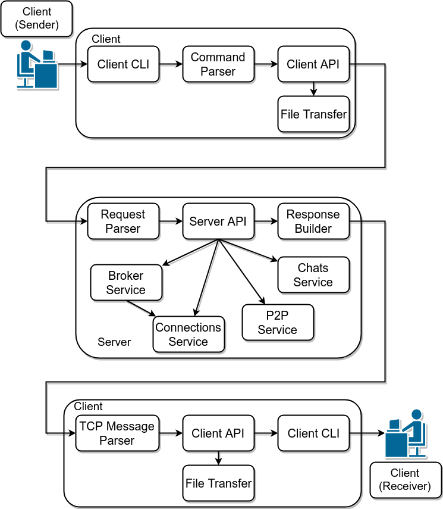
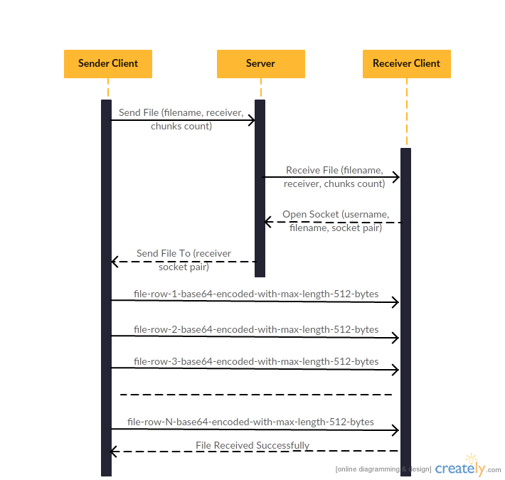

# Chat

## Running the server

`cd apps/server/`
`CHAT_PORT=4040 mix run --no-halt`

## Running the client

`cd apps/client/`
`SERVER_HOST=localhost SERVER_PORT=4040 mix run --no-halt`

## Running the tests

`mix test` in this directory runs all tests

## Architecture

## Peer-to-peer File Transfer Protocol

